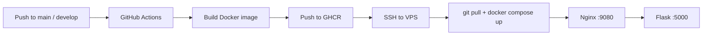

# Flask API Action

> End-to-end learning lab: **Flask API → Docker → GHCR → GitHub Actions → SSH deploy to a VPS → Nginx UI**.

[](https://github.com/nifontovoleg/flask-api-action/actions/workflows/deploy.yml)
[](https://github.com/nifontovoleg/flask-api-action/pkgs/container/flask-api-action)
[](https://www.python.org/)
[](https://flask.palletsprojects.com/)
[](https://docs.docker.com/compose/)

Image: `ghcr.io/nifontovoleg/flask-api-action:latest`

---

## Table of contents

- [Why this project](#why-this-project)
- [Who it is for](#who-it-is-for)
- [What's inside](#whats-inside)
- [How it works](#how-it-works)
- [Repository structure](#repository-structure)
- [API](#api)
- [Quick start (local)](#quick-start-local)
- [CI/CD and server deploy](#cicd-and-server-deploy)
- [How to use it](#how-to-use-it)
- [How to extend it](#how-to-extend-it)
- [Common issues](#common-issues)
- [Useful commands](#useful-commands)

---

## Why this project

This is **not a commercial product**. It is a practical DevOps training lab.

The goal is to walk through a clear path from code to a live server:

1. write a small Flask API;
2. package it with Docker;
3. build the image automatically in GitHub Actions;
4. publish it to **GitHub Container Registry (GHCR)**;
5. update containers on a VPS over SSH;
6. open a web UI through Nginx that proxies requests to the API.

The backend is intentionally simple (`/health`, `/info`, `/multiply`, `/divide`) so the focus stays on infrastructure, not business logic.

---

## Who it is for

| Audience | Why it helps |
|---|---|
| Docker / Compose beginners | See backend + frontend in one Compose network |
| People learning GitHub Actions | Ready workflow: build → push → SSH deploy |
| VPS users | Practice auto-deploy without Kubernetes |
| Portfolio / interviews | Show a full “push → production” cycle |
| API developers | Reuse the skeleton and replace demo endpoints |

If you want to “spin up an API in Docker and learn how to deploy it” — this repo is for you.

---

## What's inside

| Component | Stack | Role |
|---|---|---|
| Backend | Python 3.11 + Flask | JSON API |
| Frontend | HTML/JS + Nginx | UI and reverse proxy `/api` → Flask |
| Containers | Dockerfile + Docker Compose | Local and server runtime |
| Registry | GHCR | Stores `latest` and SHA tags |
| CI/CD | GitHub Actions | Build, push, SSH deploy |
| Deploy | `appleboy/ssh-action` | Updates containers on the server |

---

## How it works



### Browser request flow

1. Open `http://<host>:9080`
2. UI calls `/api/...`
3. Nginx proxies to `http://backend:5000/...`
4. Flask returns JSON

The frontend never talks to the container hostname from the browser, so you avoid `net::ERR_NAME_NOT_RESOLVED`.

---

## Repository structure

```text
flask-api-action/
├── app.py                       # Flask API
├── requirements.txt             # Python dependencies
├── Dockerfile                   # Backend image
├── docker-compose.yml           # backend + nginx frontend
├── .env.example                 # FRONTEND_PORT example
├── .github/
│   └── workflows/
│       └── deploy.yml           # Build → GHCR → SSH deploy
├── frontend/
│   ├── index.html               # Web UI
│   └── nginx.conf               # Proxy /api → backend
├── DOCKER_INSTRUCTIONS.md       # Short Docker cheat sheet
└── README.md                    # This file
```

---

## API

Base URL via Nginx: `/api`  
Direct Flask access: port `5000`

| Method | Path | Description |
|---|---|---|
| `GET` | `/` | Container and environment info |
| `GET` | `/health` | Healthcheck (`status: healthy`) |
| `GET` | `/info` | Python version, platform, hostname |
| `GET` | `/multiply/<a>/<b>` | Multiply two numbers |
| `GET` | `/divide/<a>/<b>` | Divide (`b=0` → `400`) |

### Examples

```bash
# via Nginx
curl http://localhost:9080/api/health
curl http://localhost:9080/api/info
curl http://localhost:9080/api/multiply/10/5
curl http://localhost:9080/api/divide/20/4

# direct Flask
curl http://localhost:5000/health
curl http://localhost:5000/info
```

`/multiply/10/5` response:

```json
{ "result": 50 }
```

---

## Quick start (local)

### Requirements

- Docker
- Docker Compose plugin (`docker compose`)

### 1. Clone

```bash
git clone https://github.com/nifontovoleg/flask-api-action.git
cd flask-api-action
```

### 2. (Optional) Frontend port

UI defaults to **9080**. If the port is busy:

```bash
cp .env.example .env
# FRONTEND_PORT=9081
```

### 3. Start

```bash
docker compose up -d --build
```

### 4. Verify

```bash
docker compose ps
curl http://localhost:9080/api/health
```

Open in browser: [http://localhost:9080](http://localhost:9080)

### 5. Stop

```bash
docker compose down
```

Docker cheat sheet: [`DOCKER_INSTRUCTIONS.md`](./DOCKER_INSTRUCTIONS.md)

---

## CI/CD and server deploy

On push to **`main`** or **`develop`**, the workflow:

1. builds the Docker image;
2. pushes it to `ghcr.io/nifontovoleg/flask-api-action`;
3. connects to the server over SSH;
4. runs `git pull` for the pushed branch;
5. logs in to GHCR;
6. updates containers (`docker compose up -d`).

### Repository secrets

Settings → Secrets and variables → Actions:

| Secret | Required | Description |
|---|---|---|
| `SSH_HOST` | yes | Server IP or hostname |
| `SSH_USER` | yes | SSH username |
| `SSH_PRIVATE_KEY` | yes | Full private key (PEM) |
| `DEPLOY_PATH` | yes | Project path on server, e.g. `/opt/flask-api-action` |
| `GHCR_TOKEN` | yes | PAT with `read:packages` (for `docker login` on the server) |

Do **not** add `SSH_PORT`: `appleboy/ssh-action` uses port **22** by default. Add it only if SSH listens on a non-standard port.

### One-time server setup

```bash
# clone into the chosen directory
sudo mkdir -p /opt/flask-api-action
sudo chown "$USER":"$USER" /opt/flask-api-action
git clone https://github.com/nifontovoleg/flask-api-action.git /opt/flask-api-action

# Docker and Compose must be installed
docker --version
docker compose version
```

Secret value:

```text
DEPLOY_PATH=/opt/flask-api-action
```

After a successful deploy:

- UI: `http://<server-ip>:9080`
- API: `http://<server-ip>:5000`

---

## How to use it

### 1. As a learning lab

Run it locally, click UI buttons, inspect Compose logs and Actions runs. Walk through `deploy.yml` step by step.

### 2. As an auto-deploy template

Copy the structure for your own service:

- keep Dockerfile / Compose / workflow;
- replace `app.py` with your backend;
- update the frontend if needed.

### 3. As a portfolio demo

Show the chain:

```text
code → image → registry → server → UI
```

A clear, interview-friendly case.

### 4. As a base for your API

Start from this skeleton and grow: database, auth, domain, HTTPS. The infra backbone is already here.

---

## How to extend it

Ideas from simple to production-ready.

### Backend

- move to **FastAPI** (async, OpenAPI out of the box);
- add PostgreSQL + SQLAlchemy 2.x;
- stop exposing full `os.environ` (demo-only today);
- input validation (Pydantic) and proper error codes;
- JWT / API keys.

### Frontend

- replace the single HTML page with an SPA (React / Vue);
- better forms, request history, themes;
- dedicated static build stage in Docker.

### Infrastructure

- HTTPS via Caddy / Traefik / Nginx + Let's Encrypt;
- domain instead of IP:port;
- staging separate from production;
- healthchecks → alerts (Telegram / email);
- backup and rollback by image tag (`:sha-...` is already pushed).

### CI/CD

- run tests and linters **before** deploy;
- deploy production only from `main`, use `develop` for staging;
- manual approval for production (`environment: production`);
- Compose overrides per environment.

### Security

- never leak secrets via `/` or logs;
- tighten CORS;
- rate limiting;
- non-root user in the container (already `appuser`);
- image scanning (Trivy) in CI.

### Scale

- multiple backend replicas behind a reverse proxy;
- external DB / Redis;
- Prometheus + Grafana metrics;
- Kubernetes later (Compose is usually enough for this lab).

---

## Common issues

### `Bind for 0.0.0.0:80` / `:8080` / `:9080` failed

The host port is already taken. Change `FRONTEND_PORT`:

```bash
cd /opt/flask-api-action
echo 'FRONTEND_PORT=9081' > .env
docker compose up -d
```

Check busy ports:

```bash
ss -tlnp | grep -E ':(80|8080|9080)\s'
```

### Workflow fails on SSH

Check `SSH_HOST`, `SSH_USER`, `SSH_PRIVATE_KEY`, `DEPLOY_PATH`.  
The public key must be in `~/.ssh/authorized_keys` on the server.

### `denied` on `docker pull` from GHCR

You need `GHCR_TOKEN` (PAT) with `read:packages`.  
If needed, make the package public: Package settings → Change visibility.

### UI loads, API does not respond

Check backend health:

```bash
docker compose ps
docker compose logs backend
curl http://localhost:5000/health
```

---

## Useful commands

```bash
# status
docker compose ps

# logs
docker compose logs -f
docker compose logs -f backend

# rebuild
docker compose up -d --build

# pull backend only from GHCR
docker pull ghcr.io/nifontovoleg/flask-api-action:latest

# stop and remove project containers
docker compose down
```

### Manual image build and push

```bash
docker login ghcr.io
docker build -t ghcr.io/nifontovoleg/flask-api-action:latest .
docker push ghcr.io/nifontovoleg/flask-api-action:latest
```

---

## License and status

Learning / demo project. Use it freely as a base for experiments and services.

If you fork it for something real, consider doing this first:

1. remove the demo environment dump from `/`;
2. enable HTTPS;
3. add at least smoke tests in CI.

---

**Author:** [nifontovoleg](https://github.com/nifontovoleg)  
**Repository:** [github.com/nifontovoleg/flask-api-action](https://github.com/nifontovoleg/flask-api-action)  
**Image:** [ghcr.io/nifontovoleg/flask-api-action](https://github.com/nifontovoleg/flask-api-action/pkgs/container/flask-api-action)
