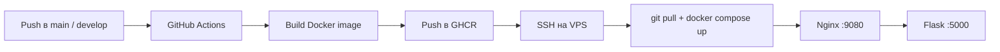

# Flask API Action

> Учебный стенд полного цикла: **Flask API → Docker → GHCR → GitHub Actions → деплой на VPS по SSH → Nginx UI**.

[](https://github.com/nifontovoleg/flask-api-action/actions/workflows/deploy.yml)
[](https://github.com/nifontovoleg/flask-api-action/pkgs/container/flask-api-action)
[](https://www.python.org/)
[](https://flask.palletsprojects.com/)
[](https://docs.docker.com/compose/)

Образ: `ghcr.io/nifontovoleg/flask-api-action:latest`

---

## Оглавление

- [Зачем этот проект](#зачем-этот-проект)
- [Для кого](#для-кого)
- [Что внутри](#что-внутри)
- [Как это работает](#как-это-работает)
- [Структура репозитория](#структура-репозитория)
- [API](#api)
- [Быстрый старт локально](#быстрый-старт-локально)
- [CI/CD и деплой на сервер](#cicd-и-деплой-на-сервер)
- [Как применять](#как-применять)
- [Как развивать](#как-развивать)
- [Частые проблемы](#частые-проблемы)
- [Полезные команды](#полезные-команды)

---

## Зачем этот проект

Это **не коммерческий продукт**, а рабочий тренажёр DevOps-пайплайна.

Цель — на простом и понятном примере пройти путь от кода до боевого сервера:

1. написать небольшой Flask API;
2. упаковать его в Docker;
3. автоматически собрать образ в GitHub Actions;
4. опубликовать образ в **GitHub Container Registry (GHCR)**;
5. по SSH обновить контейнеры на VPS;
6. открыть веб-интерфейс через Nginx, который проксирует запросы к API.

Backend специально простой (`/health`, `/info`, `/multiply`, `/divide`), чтобы всё внимание было на инфраструктуре, а не на бизнес-логике.

---

## Для кого

| Кому полезно | Зачем |
|---|---|
| Новички в Docker / Compose | Увидеть связку backend + frontend в одной сети |
| Те, кто осваивает GitHub Actions | Готовый workflow: build → push → SSH deploy |
| Люди с VPS | Отработать auto-deploy без Kubernetes |
| Портфолио / собеседования | Показать полный цикл «от push до продакшена» |
| Разработчики своего API | Взять каркас и заменить demo-эндпоинты на реальный сервис |

Если нужно «просто поднять API в Docker и научиться деплоить» — этот репозиторий как раз для этого.

---

## Что внутри

| Компонент | Технология | Роль |
|---|---|---|
| Backend | Python 3.11 + Flask | JSON API |
| Frontend | HTML/JS + Nginx | UI и reverse-proxy `/api` → Flask |
| Контейнеризация | Dockerfile + Docker Compose | Локальный и серверный запуск |
| Реестр образов | GHCR | Хранение `latest` и SHA-тегов |
| CI/CD | GitHub Actions | Сборка, пуш, деплой по SSH |
| Деплой | `appleboy/ssh-action` | Обновление контейнеров на сервере |

---

## Как это работает



### Поток запроса в браузере

1. Открываешь `http://<хост>:9080`
2. UI ходит в `/api/...`
3. Nginx проксирует на `http://backend:5000/...`
4. Flask отвечает JSON

Так фронтенд не обращается к имени контейнера напрямую из браузера — нет ошибки `net::ERR_NAME_NOT_RESOLVED`.

---

## Структура репозитория

```text
flask-api-action/
├── app.py                       # Flask API
├── requirements.txt             # Зависимости Python
├── Dockerfile                   # Образ backend
├── docker-compose.yml           # backend + nginx frontend
├── .env.example                 # Пример FRONTEND_PORT
├── .github/
│   └── workflows/
│       └── deploy.yml           # Build → GHCR → SSH deploy
├── frontend/
│   ├── index.html               # Веб-интерфейс
│   └── nginx.conf               # Proxy /api → backend
├── DOCKER_INSTRUCTIONS.md       # Краткая Docker-шпаргалка
└── README.md                    # Этот файл
```

---

## API

Базовый URL через Nginx: `/api`  
Прямой доступ к Flask: порт `5000`

| Метод | Путь | Описание |
|---|---|---|
| `GET` | `/` | Информация о контейнере и окружении |
| `GET` | `/health` | Healthcheck (`status: healthy`) |
| `GET` | `/info` | Версия Python, платформа, hostname |
| `GET` | `/multiply/<a>/<b>` | Умножение двух чисел |
| `GET` | `/divide/<a>/<b>` | Деление (при `b=0` → `400`) |

### Примеры

```bash
# через Nginx
curl http://localhost:9080/api/health
curl http://localhost:9080/api/info
curl http://localhost:9080/api/multiply/10/5
curl http://localhost:9080/api/divide/20/4

# напрямую в Flask
curl http://localhost:5000/health
curl http://localhost:5000/info
```

Ответ `/multiply/10/5`:

```json
{ "result": 50 }
```

---

## Быстрый старт локально

### Требования

- Docker
- Docker Compose plugin (`docker compose`)

### 1. Клонировать

```bash
git clone https://github.com/nifontovoleg/flask-api-action.git
cd flask-api-action
```

### 2. (Опционально) Порт фронтенда

По умолчанию UI на **9080**. Если порт занят:

```bash
cp .env.example .env
# FRONTEND_PORT=9081
```

### 3. Запустить

```bash
docker compose up -d --build
```

### 4. Проверить

```bash
docker compose ps
curl http://localhost:9080/api/health
```

Открыть в браузере: [http://localhost:9080](http://localhost:9080)

### 5. Остановить

```bash
docker compose down
```

Подробная Docker-шпаргалка: [`DOCKER_INSTRUCTIONS.md`](./DOCKER_INSTRUCTIONS.md)

---

## CI/CD и деплой на сервер

При push в ветки **`main`** или **`develop`** workflow:

1. собирает Docker-образ;
2. пушит в `ghcr.io/nifontovoleg/flask-api-action`;
3. по SSH заходит на сервер;
4. делает `git pull` нужной ветки;
5. логинится в GHCR;
6. обновляет контейнеры (`docker compose up -d`).

### Секреты репозитория

Settings → Secrets and variables → Actions:

| Secret | Обязательный | Описание |
|---|---|---|
| `SSH_HOST` | да | IP или hostname сервера |
| `SSH_USER` | да | SSH-пользователь |
| `SSH_PRIVATE_KEY` | да | Приватный ключ целиком (PEM) |
| `DEPLOY_PATH` | да | Путь к проекту на сервере, например `/opt/flask-api-action` |
| `GHCR_TOKEN` | да | PAT с правом `read:packages` (для `docker login` на сервере) |

`SSH_PORT` **добавлять не нужно**: `appleboy/ssh-action` использует порт **22** по умолчанию. Секрет нужен только если SSH слушает другой порт.

### Подготовка сервера (один раз)

```bash
# клон в выбранный каталог
sudo mkdir -p /opt/flask-api-action
sudo chown "$USER":"$USER" /opt/flask-api-action
git clone https://github.com/nifontovoleg/flask-api-action.git /opt/flask-api-action

# на сервере должны быть Docker и Compose
docker --version
docker compose version
```

В секретах:

```text
DEPLOY_PATH=/opt/flask-api-action
```

После успешного деплоя:

- UI: `http://<IP-сервера>:9080`
- API: `http://<IP-сервера>:5000`

---

## Как применять

### 1. Как учебный стенд

Подними локально, пощёлкай кнопки в UI, посмотри логи Compose и Actions. Разбери `deploy.yml` по шагам.

### 2. Как шаблон auto-deploy

Скопируй структуру под свой сервис:

- оставь Dockerfile / Compose / workflow;
- замени `app.py` на свой backend;
- при необходимости поменяй frontend.

### 3. Как демо для портфолио

Покажи связку:

```text
код → образ → реестр → сервер → UI
```

Это сильный и понятный кейс для резюме и собеседований.

### 4. Как база для своего API

Начни с этого каркаса и наращивай: БД, auth, домен, HTTPS. Инфраструктурный скелет уже есть.

---

## Как развивать

Идеи по приоритету — от простого к production.

### Backend

- перейти на **FastAPI** (async, OpenAPI из коробки);
- добавить PostgreSQL + SQLAlchemy 2.x;
- убрать отдачу всего `os.environ` наружу (сейчас это demo);
- валидация входа (Pydantic), нормальные коды ошибок;
- JWT / API keys.

### Frontend

- заменить одну HTML-страницу на SPA (React / Vue);
- красивые формы, история запросов, тёмная/светлая тема;
- отдельный stage сборки статики в Docker.

### Инфраструктура

- HTTPS через Caddy / Traefik / Nginx + Let's Encrypt;
- домен вместо IP:port;
- staging-окружение отдельно от production;
- healthchecks → алерты (Telegram / email);
- backup и rollback по тегу образа (`:sha-...` уже пушится).

### CI/CD

- прогон тестов и линтера **до** деплоя;
- деплой только с `main`, `develop` — только staging;
- ручной approve на production (`environment: production`);
- `docker compose` с разными override-файлами.

### Безопасность

- не светить секреты в `/` и логах;
- ограничить CORS;
- rate limit;
- non-root в контейнере (уже есть `appuser`);
- сканирование образа (Trivy) в CI.

### Масштаб

- несколько реплик backend за reverse-proxy;
- внешняя БД / Redis;
- метрики Prometheus + Grafana;
- при росте — Kubernetes (но для учебного стенда Compose обычно достаточно).

---

## Частые проблемы

### `Bind for 0.0.0.0:80` / `:8080` / `:9080` failed

Порт на сервере уже занят. Смени `FRONTEND_PORT`:

```bash
cd /opt/flask-api-action
echo 'FRONTEND_PORT=9081' > .env
docker compose up -d
```

Проверка занятых портов:

```bash
ss -tlnp | grep -E ':(80|8080|9080)\s'
```

### Workflow падает на SSH

Проверь секреты `SSH_HOST`, `SSH_USER`, `SSH_PRIVATE_KEY`, `DEPLOY_PATH`.  
Публичный ключ должен быть в `~/.ssh/authorized_keys` на сервере.

### `denied` при `docker pull` с GHCR

Нужен `GHCR_TOKEN` (PAT) с `read:packages`.  
Пакет в GitHub Packages при необходимости сделай public: Package settings → Change visibility.

### UI открывается, API не отвечает

Проверь, что backend healthy:

```bash
docker compose ps
docker compose logs backend
curl http://localhost:5000/health
```

---

## Полезные команды

```bash
# статус
docker compose ps

# логи
docker compose logs -f
docker compose logs -f backend

# пересборка
docker compose up -d --build

# только backend из GHCR
docker pull ghcr.io/nifontovoleg/flask-api-action:latest

# остановка и очистка контейнеров проекта
docker compose down
```

### Ручная сборка и пуш образа

```bash
docker login ghcr.io
docker build -t ghcr.io/nifontovoleg/flask-api-action:latest .
docker push ghcr.io/nifontovoleg/flask-api-action:latest
```

---

## Лицензия и статус

Учебный / демонстрационный проект. Используй свободно как основу для своих экспериментов и сервисов.

Если будешь развивать форк — имеет смысл сразу:

1. убрать demo-утечку окружения из `/`;
2. повесить HTTPS;
3. добавить хотя бы smoke-тесты в CI.

---

**Автор:** [nifontovoleg](https://github.com/nifontovoleg)  
**Репозиторий:** [github.com/nifontovoleg/flask-api-action](https://github.com/nifontovoleg/flask-api-action)  
**Образ:** [ghcr.io/nifontovoleg/flask-api-action](https://github.com/nifontovoleg/flask-api-action/pkgs/container/flask-api-action)
